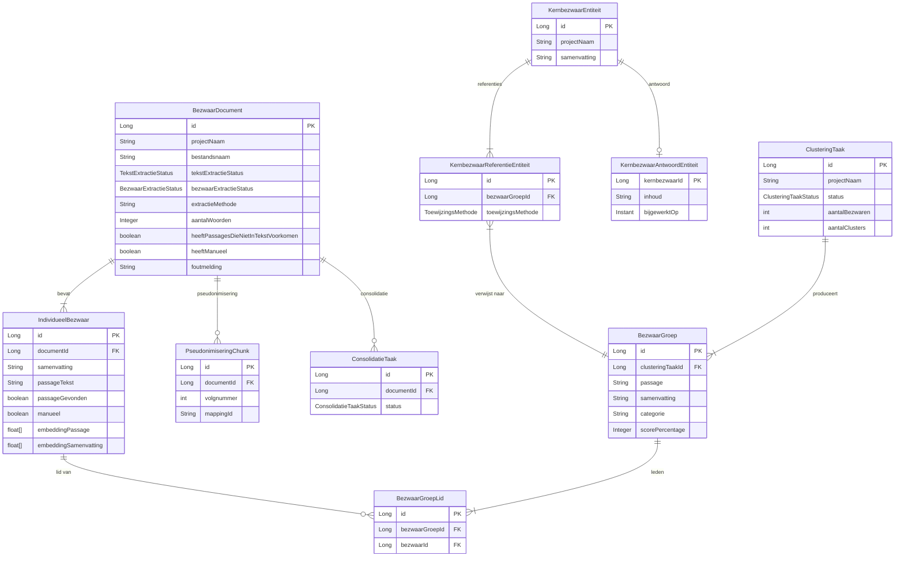

# Domeinmodel

**Laatst bijgewerkt:** 2026-03-17

---

## Entity Relationship Diagram

---

## Entiteiten per package

| Package | Entiteit | Tabel | Kernvelden |
|---------|----------|-------|------------|
| `project` | `BezwaarDocument` | `bezwaar_document` | projectNaam, bestandsnaam, tekstExtractieStatus, bezwaarExtractieStatus |
| `project` | `IndividueelBezwaar` | `individueel_bezwaar` | documentId, samenvatting, passageTekst, embeddingPassage, embeddingSamenvatting |
| `tekstextractie` | `PseudonimiseringChunk` | `pseudonimisering_chunk` | documentId, volgnummer, mappingId |
| `kernbezwaar` | `KernbezwaarEntiteit` | `kernbezwaar` | projectNaam, samenvatting |
| `kernbezwaar` | `KernbezwaarReferentieEntiteit` | `kernbezwaar_referentie` | toewijzingsMethode |
| `kernbezwaar` | `KernbezwaarAntwoordEntiteit` | `kernbezwaar_antwoord` | inhoud, bijgewerktOp |
| `kernbezwaar` | `BezwaarGroep` | `bezwaar_groep` | passage, samenvatting, categorie, scorePercentage |
| `kernbezwaar` | `BezwaarGroepLid` | `bezwaar_groep_lid` | bezwaarGroepId, bezwaarId |
| `kernbezwaar` | `ClusteringTaak` | `clustering_taak` | status, aantalBezwaren, aantalClusters |
| `consolidatie` | `ConsolidatieTaak` | `consolidatie_taak` | documentId, status |

---

## Verwijderde entiteiten (Plan 1)

| Entiteit | Reden |
|----------|-------|
| `BezwaarBestandEntiteit` | Opgegaan in `BezwaarDocument` |
| `TekstExtractieTaak` | Efemeer — status geabsorbeerd in `BezwaarDocument` |
| `ExtractieTaak` | Efemeer — status geabsorbeerd in `BezwaarDocument` |
| `ExtractiePassageEntiteit` | `passageTekst` is nu veld op `IndividueelBezwaar` |
| `BezwaarBestandStatus` | Vervangen door `TekstExtractieStatus` + `BezwaarExtractieStatus` |

## Hernoemde entiteiten (Plan 2)

| Oud | Nieuw | Reden |
|-----|-------|-------|
| `PassageGroepEntiteit` | `BezwaarGroep` | Functionele naam — groepeert bezwaren, niet passages |
| `PassageGroepLidEntiteit` | `BezwaarGroepLid` | Consistent met `BezwaarGroep` |
| `ConsolidatieTaak.projectNaam+bestandsnaam` | `ConsolidatieTaak.documentId` | FK naar `BezwaarDocument` i.p.v. losse velden |
