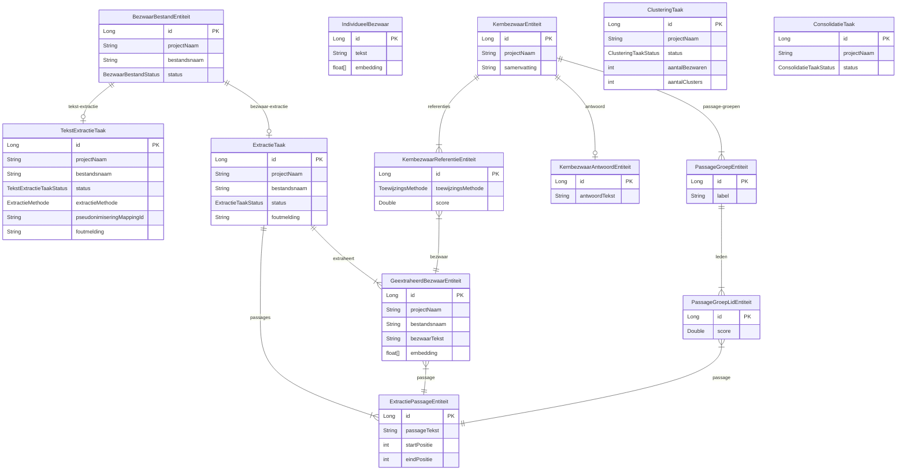

# Domeinmodel

**Laatst bijgewerkt:** 2026-03-12

---

## Entity Relationship Diagram

---

## Entiteiten per package

| Package | Entiteit | Tabel | Kernvelden |
|---------|----------|-------|------------|
| `project` | `BezwaarBestandEntiteit` | `bezwaar_bestand` | projectNaam, bestandsnaam, status |
| `project` | `ExtractieTaak` | `extractie_taak` | projectNaam, bestandsnaam, status |
| `project` | `GeextraheerdBezwaarEntiteit` | `geextraheerd_bezwaar` | bezwaarTekst, embedding |
| `project` | `ExtractiePassageEntiteit` | `extractie_passage` | passageTekst, start/eindPositie |
| `tekstextractie` | `TekstExtractieTaak` | `tekst_extractie_taak` | status, extractieMethode, **pseudonimiseringMappingId** |
| `domain` | `IndividueelBezwaar` | `individueel_bezwaar` | tekst, embedding |
| `kernbezwaar` | `KernbezwaarEntiteit` | `kernbezwaar` | projectNaam, samenvatting |
| `kernbezwaar` | `KernbezwaarReferentieEntiteit` | `kernbezwaar_referentie` | toewijzingsMethode, score |
| `kernbezwaar` | `KernbezwaarAntwoordEntiteit` | `kernbezwaar_antwoord` | antwoordTekst |
| `kernbezwaar` | `PassageGroepEntiteit` | `passage_groep` | label |
| `kernbezwaar` | `PassageGroepLidEntiteit` | `passage_groep_lid` | score |
| `kernbezwaar` | `ClusteringTaak` | `clustering_taak` | status, aantalBezwaren, aantalClusters |
| `consolidatie` | `ConsolidatieTaak` | `consolidatie_taak` | projectNaam, status |
