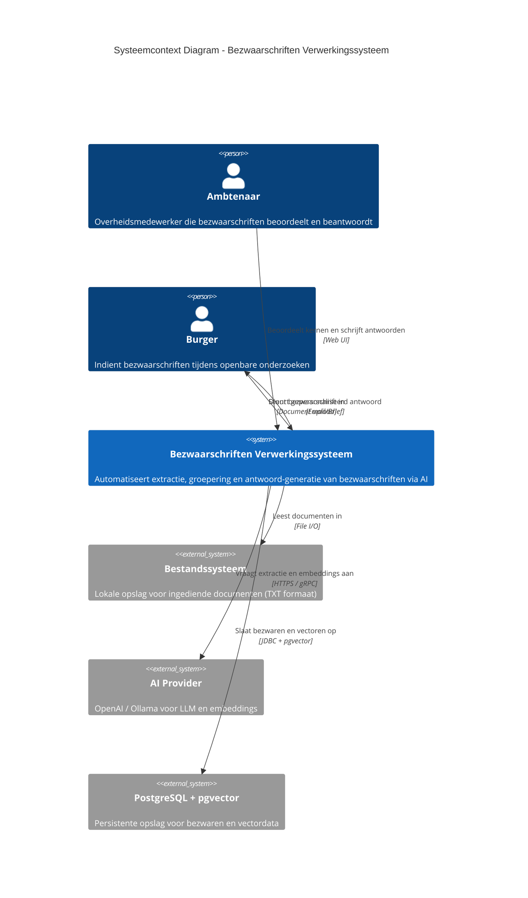

# C4 Model - C1 Systeemcontext Diagram

## Bezwaarschriften Verwerkingssysteem

**Versie:** 1.0
**Laatst bijgewerkt:** 2026-02-27
**Status:** In ontwikkeling (MS1 - Minimal Viable Pipeline)

---

## Overzicht

Het Bezwaarschriften Verwerkingssysteem automatiseert de verwerking van bezwaarschriften tijdens openbare onderzoeken. Het systeem gebruikt AI om documenten te analyseren, individuele bezwaren te extraheren, deze te groeperen en gepersonaliseerde antwoorden te genereren.

---

## C1 - Systeemcontext Diagram

---

## Actoren

### Ambtenaar (Primary Actor)
- **Rol:** Inhoudelijk expert die kernantwoorden formuleert
- **Verantwoordelijkheden:**
  - Beoordelen van gedetecteerde bezwaarkernen
  - Schrijven van juridisch sluitende kernantwoorden
  - Valideren van AI-gegenereerde gepersonaliseerde brieven
- **Skills:** Juridische kennis, domeinexpertise in het onderzoeksgebied

### Burger (Secondary Actor)
- **Rol:** Indiener van bezwaarschrift
- **Verantwoordelijkheden:**
  - Indienen van bezwaarschrift tijdens openbaar onderzoek
  - Ontvangen van gepersonaliseerd antwoord
- **Kanalen:** Document upload, email

---

## Externe Systemen

### Bestandssysteem
- **Type:** File storage
- **Technologie:** Lokaal bestandssysteem (MVP), later S3/Azure Blob
- **Doel:** Opslag van ingediende documenten
- **Formaten:**
  - **MS1 (huidige fase):** `.txt` bestanden (UTF-8)
  - **Toekomstig:** PDF, Word/DOCX, gescande documenten (OCR)
- **Interface:** Java NIO File API (`java.nio.file.Path`)

### AI Provider
- **Type:** Machine Learning Service
- **Technologie:**
  - **Production:** OpenAI API (GPT-4, text-embedding-3-small)
  - **Development:** Ollama (lokaal, mistral-small:24b, bge-m3:latest)
- **Doel:**
  - Extractie van individuele bezwaren uit documenten
  - Generatie van embeddings voor clustering
  - Groepering van gelijkaardige bezwaren
  - Generatie van gepersonaliseerde antwoorden
- **Interface:** Spring AI framework (profiel-gebaseerd: `openai` / `local`)

### PostgreSQL + pgvector
- **Type:** Relationele database met vector extensie
- **Technologie:** PostgreSQL 15+ met pgvector extensie
- **Doel:**
  - Persistente opslag van bezwaren en metadata
  - Vector similarity search voor clustering
  - Opslag van kernantwoorden en gegenereerde brieven
- **Interface:** JDBC (Spring Data JPA) + pgvector specifieke queries

---

## Systeemgrenzen

### In Scope
- Inlezen van TXT documenten (MS1)
- Extractie van individuele bezwaren via AI
- Clustering van bezwaren tot kernen
- UI voor beoordeling en antwoord-formulering
- Generatie van gepersonaliseerde brieven
- Persistentie in PostgreSQL met pgvector

### Out of Scope (voor MS1)
- PDF/Word document parsing
- OCR voor gescande documenten
- Email verzending van antwoorden
- Integratie met dossierbeheersystemen
- Multi-tenancy / gebruikersbeheer

---

## Belangrijkste Workflows

### Workflow 1: Document Ingestie en Extractie
1. Burger dient bezwaarschrift in (TXT bestand opgeslagen op bestandssysteem)
2. Systeem leest bestand in via File Ingestie component
3. Systeem stuurt tekst naar AI Provider voor extractie
4. AI identificeert individuele bezwaren met bronverwijzingen
5. Systeem slaat bezwaren op in database met embeddings

### Workflow 2: Clustering en Kernvorming
1. Systeem haalt embeddings op uit database
2. Systeem clustert gelijkaardige bezwaren via vector similarity
3. Systeem presenteert bezwaarkernen aan ambtenaar
4. Ambtenaar beoordeelt en verfijnt kernen

### Workflow 3: Antwoord Generatie
1. Ambtenaar schrijft kernantwoord voor een bezwaarkern
2. Systeem valideert via AI of kernantwoord alle nuances dekt
3. Systeem genereert gepersonaliseerde brieven per individueel bezwaar
4. Ambtenaar keurt brieven goed
5. Systeem stuurt brieven naar burgers (toekomstig)

---

## Technische Randvoorwaarden

- **Programmeertaal:** Java 21
- **Framework:** Spring Boot 3.4
- **AI Orkestratie:** Spring AI 1.0.0
- **Architectuur:** Hexagonale architectuur (Ports & Adapters)
- **Development Environment:** macOS ARM64 (Apple Silicon)
- **Deployment:** Docker Compose voor lokale ontwikkeling
- **Testing:** JUnit 5 met TDD, Testcontainers voor integratie tests

---

## Security & Privacy Overwegingen

### Data Privacy
- Bezwaarschriften bevatten potentieel privacygevoelige informatie
- **Mitigatie:**
  - Lokale verwerking waar mogelijk (Ollama optie)
  - Duidelijke ToS bij gebruik van externe AI providers
  - Logging zonder PII

### Access Control
- **MS1:** Geen formele access control (interne tool)
- **Toekomstig:** Spring Security met rolgebaseerde autorisatie

### Path Traversal
- **MS1:** Vertrouwen op bestandssysteem permissions
- **Rationale:** Interne tool, geen directe user input voor bestandspaden
- **Toekomstig:** Expliciete path validatie bij web-based upload

---

## Business Context

### Probleem
Openbare onderzoeken genereren honderden tot duizenden bezwaarschriften. Handmatige verwerking is:
- Tijdrovend (weken tot maanden)
- Foutgevoelig (argumenten worden gemist)
- Inconsistent (verschillende ambtenaren, verschillende antwoorden)

### Oplossing
AI-geassisteerde verwerking die:
- Automatisch bezwaren extraheert en groepeert
- Consistente argumentidentificatie garandeert
- Ambtenaar focust op inhoudelijke beoordeling
- Gepersonaliseerde communicatie naar burgers automatiseert

### Business Value
- **Tijdsbesparing:** 70-80% reductie in verwerkingstijd
- **Kwaliteit:** Consistente detectie van alle argumenten
- **Transparantie:** Volledige traceerbaarheid van bezwaar naar antwoord
- **Schaalbaarheid:** Systeem schaalt met aantal bezwaren

---

## Evolutie Roadmap

### MS1 (Huidige fase)
- TXT file ingestie
- Basis extractie en clustering pipeline
- CLI interface voor testen

### MS2 (Gepland)
- Web UI voor ambtenaren
- PDF/Word document parsing
- Verbeterde clustering algoritmes

### MS3 (Gepland)
- Email integratie
- OCR voor gescande documenten
- Rapportage en analytics

---

## Referenties

- **Project Spec:** `/specs/project-bezwaarschriften.md`
- **DECIBEL-1687:** Minimalistische Ingestie (TXT bestanden)
- **Architectuur Beslissingen:** `/specs/ADR.md`
