# C4 Model - C2 Container Diagram

## Bezwaarschriften Verwerkingssysteem - Container View

**Versie:** 1.4
**Laatst bijgewerkt:** 2026-03-11
**Status:** In ontwikkeling (MS1 - Minimal Viable Pipeline)

---

## Overzicht

Dit document beschrijft de Container-level architectuur van het Bezwaarschriften Verwerkingssysteem. Het toont de belangrijkste containers (applicaties, datastores) en hun onderlinge relaties, met focus op de hexagonale architectuur principes.

---

## C2 - Container Diagram

```mermaid
C4Container
    title Container Diagram - Bezwaarschriften Verwerkingssysteem

    Person(ambtenaar, "Ambtenaar", "Beoordeelt kernen en schrijft antwoorden")
    Person(burger, "Burger", "Dient bezwaarschrift in")

    System_Boundary(bezwaarsysteem, "Bezwaarschriften Verwerkingssysteem") {
        Container(webapp, "Web Application", "Lit Web Components / @domg-wc", "Project-selectie UI met bezwarenlijst en batchverwerking")
        Container(api, "REST API", "Spring Boot 3.4 / Java 21", "Exposeert endpoints voor document ingestie, projectbeheer en workflow")

        Container(project, "Project Component", "Java NIO", "Beheert projectmappen en coördineert batchverwerking van bezwarenbestanden")
        Container(ingestie, "File Ingestie Component", "Java NIO", "Leest TXT bestanden in en creëert Brondocument objecten")
        Container(tekstextractie, "Tekst Extractie Component", "PDFBox + Tesseract", "Extraheert platte tekst uit PDF/TXT met kwaliteitscontrole en OCR-fallback")
        Container(extractie, "Bezwaar Extractie Component", "Spring AI", "Extraheert individuele bezwaren uit brondocument via LLM")
        Container(clustering, "Clustering Component", "Tribuo HDBSCAN + pgvector", "Groepeert bezwaren via HDBSCAN clustering met centroid matching post-processing")
        Container(generatie, "Antwoord Generatie Component", "Spring AI", "Genereert gepersonaliseerde antwoorden via LLM")

        ContainerDb(database, "Database", "PostgreSQL 15 + pgvector", "Slaat bezwaren, embeddings, kernen en antwoorden op")
    }

    System_Ext(filesysteem, "Bestandssysteem", "Lokale file storage")
    System_Ext(openai, "OpenAI API", "GPT-4 + embeddings")
    System_Ext(ollama, "Ollama", "Lokale LLM (mistral-small:24b)")

    Rel(burger, api, "Upload document", "HTTPS (toekomstig)")
    Rel(ambtenaar, webapp, "Selecteert project en start batchverwerking", "HTTPS")
    Rel(webapp, api, "Projecten en bezwaren opvragen, verwerking starten", "REST /api/v1/projects/**")

    Rel(api, project, "Beheer projecten en bezwaren", "ProjectService")
    Rel(project, filesysteem, "Leest projectmappen", "java.nio.file.Files")
    Rel(project, ingestie, "Verwerkt .txt bestanden", "IngestiePoort")
    Rel(api, ingestie, "Leest bestand in", "IngestiePoort")
    Rel(ingestie, filesysteem, "Leest .txt bestand", "java.nio.file.Files")

    Rel(project, tekstextractie, "Verwerkt geüploade bestanden", "TekstExtractiePoort")
    Rel(tekstextractie, filesysteem, "Leest originelen, schrijft tekst", "java.nio.file.Files")
    Rel(tekstextractie, database, "Beheert extractietaken", "JPA")

    Rel(api, extractie, "Extraheert bezwaren", "BezwaarExtractiePoort")
    Rel(extractie, openai, "LLM request", "Spring AI (openai profile)")
    Rel(extractie, ollama, "LLM request", "Spring AI (local profile)")
    Rel(extractie, database, "Slaat bezwaren op", "JPA")

    Rel(api, clustering, "Clustert bezwaren", "ClusteringPoort")
    Rel(clustering, database, "Haalt embeddings op", "pgvector similarity search")
    Rel(clustering, database, "Slaat kernen op", "JPA")

    Rel(api, generatie, "Genereert antwoorden", "AntwoordGeneratiePoort")
    Rel(generatie, openai, "LLM request", "Spring AI")
    Rel(generatie, ollama, "LLM request", "Spring AI")
    Rel(generatie, database, "Slaat antwoorden op", "JPA")

    UpdateLayoutConfig($c4ShapeInRow="3", $c4BoundaryInRow="1")
```



---

## Containers Beschrijving

### 1. Project Component (DECIBEL-1706)

**Verantwoordelijkheid:** Beheert de `input/`-mappenstructuur als projectenlijst en coördineert batchverwerking van bezwaarbestanden per project.

**Technologie:**
- Java 21 NIO (`java.nio.file.Files`)
- Spring Boot 3.4 (dependency injection)
- Hexagonale architectuur: Port + Adapter pattern
- In-memory statusregister per sessie (`ConcurrentHashMap`)

**Belangrijkste Klassen:**
- `ProjectPoort` (interface/port) - Definieert contract voor projecten en bestandsopvraag
- `BestandssysteemProjectAdapter` (implementatie/adapter) - Leest projectmappen van `input/`
- `ProjectService` (orchestration service) - Beheert verwerkingsstatussen, coördineert batchverwerking
- `ProjectController` (REST controller) - Exposeert 3 endpoints
- `BezwaarBestandStatus` (enum) - TODO / TEKST_EXTRACTIE_* / BEZWAAR_EXTRACTIE_* / NIET_ONDERSTEUND
- `BezwaarBestand` (record) - Bestandsnaam + status
- `BezwaarBestandEntiteit` (JPA entity) - Persistente bestandsstatus in `bezwaar_bestand` tabel

**REST Endpoints:**
```
GET  /api/v1/projects
     → { "projecten": ["windmolens", "zonnepanelen"] }

GET  /api/v1/projects/{naam}/bezwaren
     → { "bezwaren": [{ "bestandsnaam": "bezwaar-001.txt", "status": "todo" }] }

POST /api/v1/projects/{naam}/verwerk
     → { "bezwaren": [{ "bestandsnaam": "bezwaar-001.txt", "status": "bezwaar-extractie-klaar" }] }

GET  /api/v1/projects/{naam}/tekst-extracties/{bestandsnaam}/tekst
     → { "bestandsnaam": "bezwaar-001.pdf", "tekst": "..." }
```

**Mappenstructuur:**
```
input/
├── windmolens/
│   └── bezwaren/
│       ├── bezwaar-001.txt   → status: todo/tekst-extractie-*/bezwaar-extractie-*/fout
│       └── bijlage.pdf       → status: niet ondersteund
└── zonnepanelen/
    └── bezwaren/
```

**Statusbeheer:**
- Statussen zijn persistent in de `bezwaar_bestand` tabel (JPA entity)
- Status-updates bij elk transitiepunt: upload, tekst-extractie, bezwaar-extractie
- Ondersteunde formaten: `.txt` en `.pdf`; andere formaten krijgen `niet ondersteund`

**Frontend (Web Components):**
- `bezwaarschriften-project-selectie` — Orchestrating component: laadt projecten, toont dropdown, start verwerking
- `bezwaarschriften-bezwaren-tabel` — Toont bezwarenlijst met statuslabels

---

### 2. File Ingestie Component

**Verantwoordelijkheid:** Inlezen van documenten vanaf het bestandssysteem en transformatie naar domeinobjecten.

**Technologie:**
- Java 21 NIO (`java.nio.file.Files`)
- Spring Boot 3.4 (dependency injection)
- Hexagonale architectuur: Port + Adapter pattern

**Belangrijkste Klassen:**
- `IngestiePoort` (interface/port) - Definieert contract voor file ingestie
- `BestandssysteemIngestieAdapter` (implementatie/adapter) - Concrete implementatie voor lokaal bestandssysteem
- `Brondocument` (record) - Domeinobject met tekst + metadata
- `FileIngestionException` - Custom exception voor ingestie fouten

**Data Flow:**
1. Accepteert `java.nio.file.Path` als input
2. Valideert bestand (extensie, grootte max 50MB, bestaat)
3. Leest inhoud als UTF-8 String
4. Retourneert `Brondocument` met:
   - Volledige tekstinhoud
   - Bestandsnaam
   - Absoluut pad
   - Ingestie timestamp

**Validaties:**
- Alleen `.txt` extensie toegestaan (MS1)
- Maximum bestandsgrootte: 50 MB
- Bestand moet bestaan en leesbaar zijn
- Pad mag niet null zijn
- Target moet een bestand zijn (geen directory)

**Hexagonale Architectuur:**
```
[Port]               [Adapter]                    [External]
IngestiePoort <-- BestandssysteemIngestieAdapter --> File System
                                                 --> AWS S3 (toekomstig)
                                                 --> Azure Blob (toekomstig)
```

**Configuratie:**
- `@Service` annotatie voor Spring component scanning
- Geen externe dependencies (Java stdlib only)
- Profiel-onafhankelijk (werkt in alle environments)

**Toekomstige Uitbreidingen:**
- `PdfIngestieAdapter` voor PDF parsing (Task 2.1)
- `WordIngestieAdapter` voor DOCX parsing (Task 2.1)
- `OcrIngestieAdapter` voor gescande documenten (Task 3.1)
- `CloudStorageIngestieAdapter` voor S3/Azure integratie

---

### 3. Tekst Extractie Component

**Verantwoordelijkheid:** Extraheert platte tekst uit PDF- en TXT-bestanden met kwaliteitscontrole en OCR-fallback.

**Technologie:**
- Apache PDFBox (PDFTextStripper) voor digitale PDF-extractie
- Tesseract OCR (optioneel) voor gescande documenten (nld + eng, 300 DPI)
- Java 21 NIO voor bestandsoperaties
- Spring `@Async` voor asynchrone verwerking

**Verwerkingsflow:**
1. Upload → bestand opgeslagen in `bezwaren-orig/`
2. `TekstExtractieTaak` aangemaakt met status `WACHTEND`
3. Async verwerking:
   - PDF: digitale extractie → kwaliteitscontrole → OCR-fallback indien nodig
   - TXT: directe kwaliteitscontrole
4. Resultaat: platte tekst opgeslagen in `bezwaren-text/`

**Kwaliteitscriteria:**
| Criterium | Drempelwaarde |
|---|---|
| Minimaal aantal woorden | 100 |
| Alfanumerieke ratio (excl. spaties) | >= 70% |
| Klinker/letter ratio | 20% - 60% |

**Statussen:** `WACHTEND` → `BEZIG` → `KLAAR` / `MISLUKT` / `OCR_NIET_BESCHIKBAAR`

**Gate-mechanisme:** AI-bezwaarextractie kan pas starten na succesvolle tekst-extractie (status `KLAAR`).

**Traceability:** Extractiemethode (DIGITAAL / OCR) wordt per document bijgehouden en getoond in de documententabel.

**Hexagonale Architectuur:**
```
[Port]                    [Service]                       [Adapter]
TekstExtractiePoort <-- TekstExtractieService           --> PdfTextExtractor (PDFBox)
                                                        --> OcrTextExtractor (Tesseract)
                                                        --> TekstKwaliteitsAnalyse
```

Zie ook: `docs/text-extractie.md` voor de volledige functionele beschrijving.

---

### 4. Bezwaar Extractie Component

**Verantwoordelijkheid:** Analyseert brondocument en extraheert individuele atomaire bezwaren via LLM.

**Technologie:**
- Spring AI 1.0.0
- OpenAI GPT-4 (production) / Ollama mistral-small:24b (development)
- Profiel-gebaseerde configuratie: `@Profile("openai")` / `@Profile("local")`

**Belangrijkste Klassen:**
- `BezwaarExtractiePoort` (interface/port)
- `BezwaarExtractieService` (implementatie)
- `IndividueelBezwaar` (JPA entity)

**Data Flow:**
1. Ontvangt `Brondocument` met volledige tekst
2. Stuurt tekst naar LLM met extractie-prompt
3. LLM retourneert JSON array met individuele bezwaren
4. Elk bezwaar bevat:
   - Bezwaartekst (atomaire argumentatie)
   - Bronverwijzing (karakter positie of paragraaf nummer)
   - Optioneel: sentiment, thema suggestie
5. Persisteert bezwaren in database

**AI Prompt Strategie:**
```
Analyseer het volgende bezwaarschrift en extraheer alle individuele bezwaren.
Elk bezwaar moet:
- Een atomair argument zijn (1 punt, 1 bezwaar)
- Volledig zelfstandig leesbaar zijn
- Een duidelijke bronverwijzing hebben

Formaat: JSON array
[
  {
    "bezwaar": "Er is onvoldoende rekening gehouden met...",
    "bronStart": 150,
    "bronEinde": 320
  }
]
```

**Retry & Resilience:**
- Exponential backoff retry (max 3 pogingen)
- Circuit breaker voor API failures
- Fallback naar lokale Ollama bij OpenAI downtime (toekomstig)

**Hexagonale Architectuur:**
```
[Port]                  [Service]                [Adapter]
BezwaarExtractiePoort <-- BezwaarExtractieService --> OpenAI Adapter (Spring AI)
                                                  --> Ollama Adapter (Spring AI)
```

---

### 5. Clustering Component

**Verantwoordelijkheid:** Groepeert gelijkaardige bezwaren tot kernbezwaren via HDBSCAN density-based clustering, met centroid matching post-processing voor noise-bezwaren.

**Technologie:**
- Oracle Tribuo HDBSCAN (density-based clustering)
- Spring AI (embeddings generatie: bge-m3 1024D)
- PostgreSQL pgvector (embedding opslag)
- Optionele UMAP dimensie-reductie (configureerbaar)

**Belangrijkste Klassen:**
- `TribuoClusteringAdapter` - HDBSCAN clustering via Tribuo library
- `CentroidMatchingService` - Centroid-gebaseerde noise post-processing
- `KernbezwaarService` - Orchestreert clustering + samenvatting generatie
- `ClusteringTaakService` - Beheer van async clustering taken
- `ClusteringWorker` - Async verwerking via `@Async`
- `ClusteringConfig` - Configureerbare parameters (minClusterSize, epsilon, centroidMatchingThreshold)
- `KernbezwaarEntiteit` / `KernbezwaarReferentieEntiteit` - JPA entities

**Clustering Pipeline (per project):**
1. Haalt alle `GeextraheerdBezwaar` records op voor het project
2. Gebruikt bestaande bge-m3 embeddings (1024D) uit pgvector
3. Optioneel: UMAP dimensie-reductie (configureerbaar: nComponents, nNeighbors, minDist)
4. HDBSCAN clustering: minClusterSize, minSamples, clusterSelectionEpsilon
5. **Centroid matching post-processing:**
   - Berekent centroid (gemiddelde vector) per cluster
   - Voor elk noise-bezwaar (HDBSCAN label -1): cosine similarity naar alle centroids
   - Als similarity >= threshold (default 0.85): wijs toe aan best matchend cluster (`CENTROID_FALLBACK`)
   - Onder threshold: blijft noise, top-5 suggesties beschikbaar voor handmatige toewijzing
6. Genereert samenvatting per kernbezwaar via LLM
7. Persisteert kernbezwaren direct onder project (geen thema/categorie-laag)

**Toewijzingsmethoden:**
- `HDBSCAN` — Direct door HDBSCAN algoritme geclusterd
- `CENTROID_FALLBACK` — Automatisch toegewezen via centroid matching (boven threshold)
- `MANUEEL` — Door ambtenaar handmatig toegewezen vanuit noise

**REST Endpoints (clustering):**
```
GET  /api/v1/projects/{naam}/clustering-taken
     → { id, status, aantalBezwaren, ... } (enkele taak per project)

POST /api/v1/projects/{naam}/clustering-taken
     → Start clustering (202 Accepted)

DELETE /api/v1/projects/{naam}/clustering-taken[?bevestigd=true]
     → Verwijder clustering (409 als antwoorden bestaan)
```

**REST Endpoints (kernbezwaren):**
```
GET  /api/v1/projects/{naam}/kernbezwaren
     → { kernbezwaren: [{ id, samenvatting, individueleBezwaren, antwoord }] }

PUT  /api/v1/projects/{naam}/kernbezwaren/{id}/antwoord
     → Sla antwoord op (409 bij bestaande consolidatie)

GET  /api/v1/projects/{naam}/noise/{bezwaarId}/suggesties
     → [{ kernbezwaarId, scorePercentage, samenvatting }] (top-5)

PUT  /api/v1/projects/{naam}/referenties/{referentieId}/toewijzing
     → Handmatige toewijzing van noise-bezwaar aan kernbezwaar
```

**Hexagonale Architectuur:**
```
[Controller]              [Service]                      [Adapter/Repository]
ClusteringTaakController → ClusteringTaakService         → ClusteringTaakRepository
                         → ClusteringWorker (async)      → TribuoClusteringAdapter
KernbezwaarController    → KernbezwaarService            → KernbezwaarRepository
                         → CentroidMatchingService       → KernbezwaarReferentieRepository
                                                         → Spring AI Embedding Client
```

---

### 6. Antwoord Generatie Component

**Verantwoordelijkheid:** Genereert gepersonaliseerde antwoorden op individuele bezwaren op basis van kernantwoord.

**Technologie:**
- Spring AI (LLM orchestratie)
- OpenAI GPT-4 / Ollama mistral-small

**Data Flow:**
1. Ontvangt kernantwoord geschreven door ambtenaar
2. Ontvangt lijst van individuele bezwaren in deze kern
3. Voor elk bezwaar:
   - Stuurt kernantwoord + specifiek bezwaar naar LLM
   - LLM personaliseert antwoord voor dit specifieke bezwaar
   - Valideert dat alle nuances gedekt zijn
4. Retourneert gepersonaliseerde antwoordtekst

**AI Validatie:**
- LLM controleert of kernantwoord alle aspecten van individueel bezwaar dekt
- Bij ontbrekende nuances: waarschuwing naar ambtenaar
- Ambtenaar kan kernantwoord aanpassen of individueel antwoord overschrijven

---

### 7. Database (PostgreSQL + pgvector)

**Verantwoordelijkheid:** Persistente opslag van alle domeinobjecten en vector embeddings.

**Technologie:**
- PostgreSQL 15+
- pgvector extensie voor vector storage en similarity search
- Spring Data JPA voor ORM

**Schema (MS1):**

```sql
-- Brondocumenten (toekomstig: via JPA entity)
CREATE TABLE brondocument (
    id BIGSERIAL PRIMARY KEY,
    bestandsnaam VARCHAR(255) NOT NULL,
    pad TEXT NOT NULL,
    tekst TEXT NOT NULL,
    ingestie_timestamp TIMESTAMP NOT NULL,
    created_at TIMESTAMP DEFAULT CURRENT_TIMESTAMP
);

-- Individuele bezwaren
CREATE TABLE individueel_bezwaar (
    id BIGSERIAL PRIMARY KEY,
    tekst TEXT NOT NULL,
    embedding VECTOR(1536),  -- OpenAI ada-002 dimensie
    brondocument_id BIGINT REFERENCES brondocument(id),
    bron_start INT,
    bron_einde INT,
    created_at TIMESTAMP DEFAULT CURRENT_TIMESTAMP
);

-- Bezwaarkernen (toekomstig)
CREATE TABLE bezwaarkern (
    id BIGSERIAL PRIMARY KEY,
    beschrijving TEXT NOT NULL,
    aantal_bezwaren INT NOT NULL,
    kernantwoord TEXT,
    status VARCHAR(50),  -- DETECTED, APPROVED, ANSWERED
    created_at TIMESTAMP DEFAULT CURRENT_TIMESTAMP
);

-- Many-to-Many: bezwaren <-> kernen
CREATE TABLE bezwaar_kern_koppeling (
    bezwaar_id BIGINT REFERENCES individueel_bezwaar(id),
    kern_id BIGINT REFERENCES bezwaarkern(id),
    PRIMARY KEY (bezwaar_id, kern_id)
);

-- Pgvector index voor snelle similarity search
CREATE INDEX idx_bezwaar_embedding ON individueel_bezwaar
USING ivfflat (embedding vector_cosine_ops)
WITH (lists = 100);
```

**Vector Storage:**
- Dimensie: 1536 (OpenAI text-embedding-3-small) of 1024 (bge-m3)
- Distance metric: Cosine distance (`<=>` operator)
- Index: IVFFlat voor performance op grote datasets

**Backup & Recovery:**
- Dagelijkse PostgreSQL dumps
- pgvector data is reproduceerbaar via re-embedding
- Retention: 90 dagen

---

### 8. REST API

**Verantwoordelijkheid:** Exposeert HTTP endpoints voor frontend en externe integraties.

**Technologie:**
- Spring Boot 3.4
- Spring Web MVC
- Spring Security (toekomstig)

**Endpoints (MS1 — geïmplementeerd):**

```
GET /api/v1/projects
- Geeft lijst van beschikbare projecten (subdirectories van input/)
- Response: { "projecten": [...] }

GET /api/v1/projects/{naam}/bezwaren
- Geeft bezwaarbestanden van een project met hun status
- Response: { "bezwaren": [{ "bestandsnaam": "...", "status": "todo|tekst-extractie-*|bezwaar-extractie-*|niet ondersteund" }] }
- 404 als project niet bestaat

POST /api/v1/projects/{naam}/verwerk
- Start batchverwerking voor alle todo .txt-bestanden van een project
- Response: bijgewerkte bezwarenlijst met statussen

GET /api/v1/projects/{naam}/tekst-extracties/{bestandsnaam}/tekst
- Geeft de geëxtraheerde tekst van een bezwaarschrift
- Response: { "bestandsnaam": "...", "tekst": "..." }
- 404 als tekst niet beschikbaar (extractie niet klaar)
```

**Endpoints (toekomstig):**

```
POST /api/v1/documenten/upload
- Upload nieuw bezwaarschrift
- Request: multipart/form-data
- Response: Document ID + status

GET /api/v1/documenten/{id}
- Haal document metadata op
- Response: Brondocument JSON

POST /api/v1/extractie/{documentId}
- Start extractie workflow
- Response: Job ID

GET /api/v1/bezwaren
- Lijst alle gedetecteerde bezwaren
- Query params: filtering, paginatie

GET /api/v1/kernen
- Lijst alle bezwaarkernen
- Query params: status filter

POST /api/v1/kernen/{kernId}/antwoord
- Sla kernantwoord op
- Request: antwoordtekst
- Response: 201 Created

POST /api/v1/kernen/{kernId}/genereer
- Genereer gepersonaliseerde antwoorden
- Response: Job ID voor async processing
```

**Security (toekomstig MS2):**
- JWT authentication
- RBAC: ambtenaar, admin rollen
- CORS configuratie voor frontend

---

### 9. Web Application

**Verantwoordelijkheid:** User interface voor ambtenaren.

**Technologie:**
- Lit Web Components (`BaseHTMLElement`, `defineWebComponent`)
- @domg-wc component library (Vlaamse Overheid design system)
- Webpack 5 bundeling
- REST client naar API (fetch API)

**Geïmplementeerde Features:**
- Projectkeuze via dropdown (`vl-select`)
- Bezwarenlijst met statusweergave (`bezwaarschriften-bezwaren-tabel`)
- Batchverwerking starten ("Verwerk alles" knop)
- Foutmeldingen bij API-fouten
- **Kernbezwaren flat list** — Kernbezwaren direct onder project (geen categorie/thema-laag)
- **Clustering beheer** — Start/annuleer/retry/verwijder clustering per project
- **Configureerbare parameters** — HDBSCAN + UMAP parameters in UI
- **Side panel met paginering** — Passage-deduplicatie, 15 per pagina
- **Toewijzingsmethode badges** — CENTROID_FALLBACK (oranje), MANUEEL (blauw)
- **Handmatige toewijzing** — Noise-bezwaren toewijzen via top-5 suggesties dropdown
- **Antwoord editor** — Rich text editor per kernbezwaar met consolidatie-waarschuwing
- **Score badges** — Cosine similarity percentage per passage

**Web Components:**
- `bezwaarschriften-project-selectie` — Orchestrating component
- `bezwaarschriften-bezwaren-tabel` — Bezwarenlijst met extractie-details en oog-knop voor tekst-preview
- `bezwaarschriften-tekst-panel` — Linkse side-sheet die geëxtraheerde tekst toont (LitElement)
- `bezwaarschriften-kernbezwaren` — Kernbezwaren lijst, side panel, toewijzing

**Toekomstige Features:**
- Antwoord preview en goedkeuring
- Analytics dashboard

---

## Inter-Container Communicatie

### Project Batchverwerking Flow (DECIBEL-1706)
```
Web Application (bezwaarschriften-project-selectie)
  └─> GET /api/v1/projects
       └─> ProjectController → ProjectService → ProjectPoort
            └─> BestandssysteemProjectAdapter → File System (input/)
  └─> GET /api/v1/projects/{naam}/bezwaren
       └─> ProjectController → ProjectService → in-memory statusRegister
  └─> POST /api/v1/projects/{naam}/verwerk
       └─> ProjectController → ProjectService
            ├─> IngestiePoort.leesBestand(pad)  [voor elk .txt bestand]
            └─> statusRegister.put(bestand, EXTRACTIE_KLAAR | FOUT)
```

### Tekst Extractie Flow
```
Web Application
  └─> Upload bestand (PDF/TXT)
       └─> ProjectController → ProjectService
            └─> Opslag in bezwaren-orig/
            └─> TekstExtractieTaak aanmaken (WACHTEND)
            └─> TekstExtractieWorker (async)
                 ├─> PDF: PdfTextExtractor (PDFBox PDFTextStripper)
                 │    └─> TekstKwaliteitsAnalyse
                 │         ├─> OK → KLAAR
                 │         └─> Niet OK → OcrTextExtractor (Tesseract nld+eng 300DPI)
                 │              └─> TekstKwaliteitsAnalyse → KLAAR / MISLUKT
                 ├─> TXT: TekstKwaliteitsAnalyse → KLAAR / MISLUKT
                 └─> Resultaat opslaan in bezwaren-text/
  └─> WebSocket update naar frontend
```

### Ingestie Flow
```
API Container
  └─> IngestiePoort.leesBestand(Path)
       └─> BestandssysteemIngestieAdapter
            └─> File System (java.nio)
  └─> Retourneert Brondocument
```

### Extractie Flow
```
API Container
  └─> BezwaarExtractiePoort.extraheerBezwaren(Brondocument)
       └─> BezwaarExtractieService
            ├─> Spring AI (OpenAI/Ollama)
            └─> Database (JPA save)
  └─> Retourneert List<IndividueelBezwaar>
```

### Clustering Flow
```
Web Application
  └─> POST /api/v1/projects/{naam}/clustering-taken
       └─> ClusteringTaakController → ClusteringTaakService
            └─> ClusteringWorker.verwerkTaak (async)
                 └─> KernbezwaarService.clusterProject(projectNaam, taakId)
                      ├─> Database (find all bezwaren + embeddings)
                      ├─> TribuoClusteringAdapter (HDBSCAN clustering)
                      ├─> CentroidMatchingService.wijsNoiseToe(centroids, noise, threshold)
                      │    └─> Cosine similarity → CENTROID_FALLBACK of noise
                      ├─> Spring AI (samenvatting generatie per cluster)
                      └─> Database (save Kernbezwaar + Referenties met ToewijzingsMethode)
  └─> WebSocket update naar frontend

  (handmatige toewijzing)
  └─> GET /api/v1/projects/{naam}/noise/{bezwaarId}/suggesties
       └─> KernbezwaarService.geefSuggesties → CentroidMatchingService.berekenTop5Suggesties
  └─> PUT /api/v1/projects/{naam}/referenties/{referentieId}/toewijzing
       └─> KernbezwaarService.wijsToeAanKernbezwaar → ToewijzingsMethode.MANUEEL
```

---

## Hexagonale Architectuur Principes

### Ports (Interfaces)
Alle domeinlogica wordt aangestuurd via port interfaces:
- `IngestiePoort` - Document inlezen
- `TekstExtractiePoort` - Tekst extractie uit PDF/TXT met kwaliteitscontrole
- `BezwaarExtractiePoort` - Bezwaar extractie
- `ClusteringPoort` - Groepering
- `AntwoordGeneratiePoort` - Antwoord generatie

### Adapters (Implementaties)
Concrete implementaties zijn inwisselbaar:
- **Ingestie:** BestandssysteemAdapter → S3Adapter
- **AI:** OpenAIAdapter ↔ OllamaAdapter (profiel-switch)
- **Database:** JpaAdapter → MongoAdapter (theoretisch)

### Voordelen
- **Testbaarheid:** Mock ports voor unit tests
- **Flexibiliteit:** Wissel AI provider zonder domeinlogica wijziging
- **Isolation:** Domein onafhankelijk van infrastructuur
- **Evolution:** Nieuwe adapters zonder breaking changes

---

## Deployment Architectuur (Lokale Ontwikkeling)

### Docker Compose Setup
```yaml
services:
  postgres:
    image: pgvector/pgvector:pg15
    environment:
      POSTGRES_DB: bezwaarschriften
      POSTGRES_USER: app
      POSTGRES_PASSWORD: secret
    ports:
      - "5432:5432"
    volumes:
      - pgdata:/var/lib/postgresql/data

  ollama:
    image: ollama/ollama:latest
    ports:
      - "11434:11434"
    volumes:
      - ollama_data:/root/.ollama

  app:
    build: .
    environment:
      SPRING_PROFILES_ACTIVE: local
      SPRING_DATASOURCE_URL: jdbc:postgresql://postgres:5432/bezwaarschriften
      SPRING_AI_OLLAMA_BASE_URL: http://ollama:11434
    ports:
      - "8080:8080"
    depends_on:
      - postgres
      - ollama
```

### Profiel Configuratie

**application-openai.yml**
```yaml
spring:
  ai:
    openai:
      api-key: ${OPENAI_API_KEY}
      chat:
        model: gpt-4
      embedding:
        model: text-embedding-3-small
```

**application-local.yml**
```yaml
spring:
  ai:
    ollama:
      base-url: http://localhost:11434
      chat:
        model: mistral-small:24b
        options:
          num-predict: 4096
      embedding:
        model: bge-m3:latest
```

---

## Performance Overwegingen

### Bottlenecks
1. **LLM API calls:** 2-10 seconden per request
   - **Mitigatie:** Async processing, batch requests
2. **Vector similarity search:** O(n²) complexity
   - **Mitigatie:** IVFFlat index, query optimalisatie
3. **Large file uploads:** 50MB max
   - **Mitigatie:** Streaming upload, chunk processing

### Caching Strategie
- **Embeddings:** Cache in database (regenereer alleen bij tekst wijziging)
- **LLM responses:** Optioneel cachen van identieke prompts
- **Static content:** CDN voor frontend assets (toekomstig)

### Monitoring
- Spring Boot Actuator endpoints
- Prometheus metrics
- Grafana dashboards
- LLM API usage tracking

---

## Security & Resilience

### Error Handling
- `FileIngestionException` voor ingestie fouten
- `AIServiceException` voor LLM failures (toekomstig)
- Global exception handler in REST API
- Retry met exponential backoff

### Data Validation
- Input sanitization voor LLM prompts (prompt injection beveiliging, Task 4.7)
- File size limits (50 MB)
- Extension whitelist (.txt in MS1)
- UTF-8 encoding validatie

### Resilience Patterns
- Circuit breaker voor AI provider
- Fallback naar Ollama bij OpenAI downtime
- Database connection pooling
- Request timeout configuratie

---

## Evolutie & Uitbreidbaarheid

### Nieuwe Adapters Toevoegen
Voorbeeld: S3 ingestie adapter
```java
@Service
@Profile("cloud")
public class S3IngestieAdapter implements IngestiePoort {
    private final S3Client s3Client;

    @Override
    public Brondocument leesBestand(Path pad) {
        // S3 specifieke implementatie
        String bucketName = extractBucket(pad);
        String key = extractKey(pad);
        String content = s3Client.getObjectAsString(
            GetObjectRequest.builder()
                .bucket(bucketName)
                .key(key)
                .build()
        );
        return new Brondocument(content, key, pad.toString(), Instant.now());
    }
}
```

### Nieuwe AI Provider Toevoegen
Spring AI abstraheert provider details:
```yaml
spring:
  profiles:
    active: anthropic  # Nieuw profiel

  ai:
    anthropic:
      api-key: ${ANTHROPIC_API_KEY}
      chat:
        model: claude-3-opus
```

Geen code wijzigingen nodig in services.

---

## Referenties

- **C1 Systeemcontext:** `docs/c4-c1-systeemcontext.md`
- **DECIBEL-1687 Spec:** `/specs/DECIBEL-1687.md`
- **Hexagonale Architectuur:** Alistair Cockburn's Ports & Adapters pattern
- **Spring AI Docs:** https://docs.spring.io/spring-ai/reference/
- **pgvector Docs:** https://github.com/pgvector/pgvector
