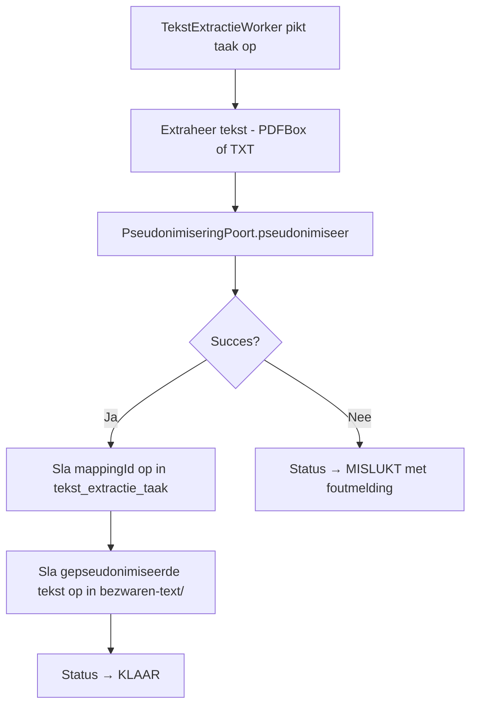

# Obscuro Pseudonimisering Integratie

## Doel

Na tekst-extractie wordt de geextraheerde tekst gepseudonimiseerd via de Obscuro-service voordat deze wordt opgeslagen in `bezwaren-text/`. De mapping-ID voor de-pseudonimisering wordt opgeslagen in de database.

## Scope

- Pseudonimisering toepassen na tekst-extractie, voor opslag
- Mapping-ID persisteren in `tekst_extractie_taak`
- Obscuro als Docker container naast de applicatie draaien
- E2E test voor de volledige happy path + unit tests
- **Buiten scope**: de-pseudonimisering UI/API, briefgeneratie-integratie

## Architectuur

### Hexagonale structuur

```
TekstExtractieService
    ↓ (na extractie, voor opslag — ongeacht bron: PDF of TXT)
    PseudonimiseringPoort (interface)
        ↓
    ObscuroAdapter (HTTP → Obscuro API)
```

### Nieuwe componenten

| Component | Package | Verantwoordelijkheid |
|---|---|---|
| `PseudonimiseringPoort` | `tekstextractie` | Port: `pseudonimiseer(tekst) → PseudonimiseringResultaat` |
| `PseudonimiseringResultaat` | `tekstextractie` | Record: `gepseudonimiseerdeTekst` + `mappingId` |
| `ObscuroAdapter` | `tekstextractie` | HTTP client naar Obscuro `/pseudonymize` |
| `PseudonimiseringConfig` | `tekstextractie` | `@ConfigurationProperties(prefix = "bezwaarschriften.pseudonimisering")`: URL, TTL, timeouts |

Naamgeving volgt bestaande patronen: `*Config` suffix (zoals `ExtractieConfig`, `EmbeddingConfig`), adapter in zelfde package als port (zoals `BestandssysteemProjectAdapter` in `project`).

### Aangepaste componenten

| Component | Wijziging |
|---|---|
| `TekstExtractieService` | Na extractie → `pseudonimiseringPoort.pseudonimiseer()` aanroepen, mapping-ID opslaan. Pseudonimisering geldt voor **beide** extractiepaden (PDF en TXT). |
| `TekstExtractieTaak` | Nieuw veld `pseudonimiseringMappingId` |
| `docker-compose.yml` | Nieuw bestand in project root — Obscuro container toevoegen naast bestaande PostgreSQL |

### Ontwerpkeuze: RestClient

`ObscuroAdapter` gebruikt Spring `RestClient` (synchroon). Dit is een bewuste keuze: de tekst-extractie flow is synchroon (anders dan de embedding flow die `WebClient` gebruikt). `RestClient` is eenvoudiger en past beter bij deze context.

## Datamodel

### Liquibase changelog: `20260311-pseudonimisering-mapping.xml`

Toevoegen aan `app/src/main/resources/config/liquibase/changelog/` en registreren in `master.xml`.

```sql
ALTER TABLE tekst_extractie_taak
  ADD COLUMN pseudonimisering_mapping_id VARCHAR(255);
```

Nullable — bestaande records hebben geen mapping. `VARCHAR(255)` i.p.v. `VARCHAR(36)` voor robuustheid: Obscuro API-contract is extern en niet onder onze controle.

## API-interactie met Obscuro

### Pseudonimiseren

```
POST http://obscuro:8000/pseudonymize
Content-Type: application/json

{
  "text": "<geextraheerde tekst>",
  "ttl_seconds": 31536000
}

Response:
{
  "text": "<gepseudonimiseerde tekst>",
  "mapping_id": "550e8400-e29b-41d4-a716-446655440000"
}
```

### HTTP Client

- Spring `RestClient` (synchroon)
- Connect timeout: 30s (configureerbaar)
- Read timeout: 120s (configureerbaar, grote documenten)
- Fout → taak status `MISLUKT` met foutmelding

## Configuratie

### application.yml

```yaml
bezwaarschriften:
  pseudonimisering:
    url: http://localhost:8000
    ttl-seconds: 31536000
    connect-timeout: 30s
    read-timeout: 120s
```

### docker-compose.yml (nieuw bestand in project root)

Bevat zowel de bestaande PostgreSQL als de nieuwe Obscuro container:

```yaml
obscuro:
  image: ghcr.io/kevcraey/obscuro-service:latest
  ports:
    - "8000:8000"
  environment:
    - PYTHONUNBUFFERED=1
  restart: unless-stopped
  healthcheck:
    test: python -c "import urllib.request; urllib.request.urlopen('http://localhost:8000/health')"
    interval: 30s
    timeout: 10s
    retries: 3
    start_period: 60s
```

De TTL wordt per request meegegeven vanuit de applicatie (`ttl-seconds` in `application.yml`). De Docker-level `TTL_SECONDS` env var is niet nodig omdat elke request zijn eigen TTL specificeert.

## Aangepaste flow



**Opmerking**: mappingId wordt eerst opgeslagen in de database (stap E) voordat de tekst naar het bestandssysteem gaat (stap F). Zo is de mapping-ID altijd beschikbaar, ook als de bestandsopslag faalt.

## Testen

### Unit tests

| Test | Scope |
|---|---|
| `ObscuroAdapterTest` | Mocked HTTP responses (succes, 4xx, 5xx, timeout) via MockRestServiceServer |
| `TekstExtractieServiceTest` | Verify pseudonimiseringspoort wordt aangeroepen en mappingId opgeslagen (mock port) |

### E2E test (integratietest)

- **Testcontainers**: `GenericContainer` met Obscuro Docker image
- **Volledige happy path**: upload PDF → extractie → pseudonimisering → opslag → verificatie
- **Draait als onderdeel van**: `mvn verify`

### Testdata

PDF met bekende PII: naam, IBAN, adres. Zodat we kunnen verifiëren dat tokens (`{persoon_1}`, `{rekeningnummer_1}`) in de output staan.

### Verificatiepunten

1. Tekst in `bezwaren-text/` bevat pseudonimiseringstokens i.p.v. originele PII
2. `pseudonimisering_mapping_id` is opgeslagen in de database (niet null, geldig UUID)
3. Taakstatus is `KLAAR`
4. Extractiemethode is correct ingevuld

## Foutafhandeling

| Scenario | Gedrag |
|---|---|
| Obscuro niet bereikbaar | Taak → `MISLUKT`, foutmelding bevat connectie-error |
| Obscuro retourneert HTTP 4xx/5xx | Taak → `MISLUKT`, foutmelding bevat statuscode + body |
| Tekst te lang (>100.000 tekens) | Obscuro retourneert 400, taak → `MISLUKT` |
| Timeout | Taak → `MISLUKT`, foutmelding bevat timeout-info |
