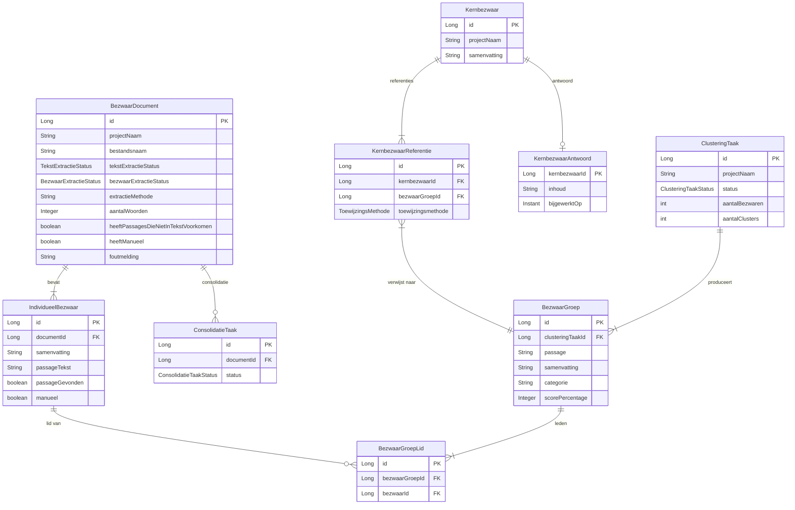

# Domeinmodel Cleanup — Design Spec

**Doel:** Zuiver domeinmodel vanuit DDD-principes. Document als aggregate root, taken worden efemeer, juiste verantwoordelijkheden op het juiste concept.

---

## Kernprincipes

1. **BezwaarDocument is de aggregate root** — alles hangt aan het document, niet aan taken.
2. **Taken zijn efemeer** — aanmaken, verwerken, resultaat absorberen in het document, weg.
3. **Twee losse statussen** op het document: `tekstExtractieStatus` en `bezwaarExtractieStatus`.
4. **Passage is een eigenschap van een bezwaar**, geen apart concept.

---

## Domeinmodel

### BezwaarDocument

Vervangt: `BezwaarBestandEntiteit`, `TekstExtractieTaak`, `ExtractieTaak`

| Veld | Type | Toelichting |
|------|------|-------------|
| id | Long (PK) | |
| projectNaam | String (NOT NULL) | |
| bestandsnaam | String (NOT NULL) | |
| tekstExtractieStatus | Enum: GEEN, BEZIG, KLAAR, FOUT | |
| bezwaarExtractieStatus | Enum: GEEN, BEZIG, KLAAR, FOUT | |
| extractieMethode | String (nullable) | PDF, OCR, ... |
| aantalWoorden | Integer (nullable) | Resultaat van bezwaar-extractie |
| heeftPassagesDieNietInTekstVoorkomen | boolean | |
| heeftManueel | boolean | |
| foutmelding | String (nullable) | Fout bij tekst- of bezwaar-extractie |

`aantalBezwaren` wordt niet opgeslagen — afgeleid via `count()` op kinderen.

**Kinderen:**
- `IndividueelBezwaar` (1:N via documentId)

**Status-mapping vanuit huidig model:**

| Huidige BezwaarBestandStatus | Nieuw |
|------------------------------|-------|
| `TODO` | `tekstExtractieStatus = GEEN, bezwaarExtractieStatus = GEEN` |
| `TEKST_EXTRACTIE_WACHTEND` | `tekstExtractieStatus = BEZIG` |
| `TEKST_EXTRACTIE_BEZIG` | `tekstExtractieStatus = BEZIG` |
| `TEKST_EXTRACTIE_KLAAR` | `tekstExtractieStatus = KLAAR, bezwaarExtractieStatus = GEEN` |
| `TEKST_EXTRACTIE_MISLUKT` | `tekstExtractieStatus = FOUT` |
| `TEKST_EXTRACTIE_OCR_NIET_BESCHIKBAAR` | `tekstExtractieStatus = FOUT` + foutmelding |
| `WACHTEND` | `bezwaarExtractieStatus = BEZIG` |
| `BEZIG` | `bezwaarExtractieStatus = BEZIG` |
| `EXTRACTIE_KLAAR` | `bezwaarExtractieStatus = KLAAR` |
| `FOUT` | `bezwaarExtractieStatus = FOUT` |
| `NIET_ONDERSTEUND` | Geen BezwaarDocument — bestandsformaat-check in ProjectService, geen entiteit |

### IndividueelBezwaar

Vervangt: `GeextraheerdBezwaarEntiteit` + `ExtractiePassageEntiteit`

| Veld | Type | Toelichting |
|------|------|-------------|
| id | Long (PK) | |
| documentId | Long (FK → BezwaarDocument) | |
| samenvatting | String | AI-samenvatting van het bezwaar |
| passageTekst | String | Brontekst uit het document (was: apart in ExtractiePassageEntiteit) |
| passageGevonden | boolean | Of de passage in de oorspronkelijke tekst is teruggevonden |
| manueel | boolean | Handmatig toegevoegd door gebruiker |
| embeddingPassage | float[] | Embedding van de passagetekst |
| embeddingSamenvatting | float[] | Embedding van de samenvatting |

`passageNr` verdwijnt — was nodig om bezwaar aan passage te koppelen via taakId. Door de 1:1 merge is dit overbodig.

### BezwaarGroep

Vervangt: `PassageGroepEntiteit`

| Veld | Type | Toelichting |
|------|------|-------------|
| id | Long (PK) | |
| clusteringTaakId | Long (FK → ClusteringTaak) | |
| passage | String (text) | Representatieve passagetekst van de groep |
| samenvatting | String (text) | Samenvatting van de groep |
| categorie | String | Categorie-label (bv. modus A/B) |
| scorePercentage | Integer (nullable) | Gelijkenispercentage |

### BezwaarGroepLid

Vervangt: `PassageGroepLidEntiteit`

| Veld | Type | Toelichting |
|------|------|-------------|
| id | Long (PK) | |
| bezwaarGroepId | Long (FK → BezwaarGroep) | |
| bezwaarId | Long (FK → IndividueelBezwaar) | |

`bestandsnaam` verdwijnt — afleidbaar via `bezwaarId → IndividueelBezwaar → documentId → BezwaarDocument.bestandsnaam`.

### Kernbezwaar

Ongewijzigd.

| Veld | Type |
|------|------|
| id | Long (PK) |
| projectNaam | String |
| samenvatting | String |

### KernbezwaarReferentie

Link Kernbezwaar → BezwaarGroep (was: `passageGroepId`, hernoemd naar `bezwaarGroepId`)

| Veld | Type |
|------|------|
| id | Long (PK) |
| kernbezwaarId | Long (FK → Kernbezwaar) |
| bezwaarGroepId | Long (FK → BezwaarGroep) |
| toewijzingsmethode | Enum (HDBSCAN, CENTROID, HANDMATIG) |

### KernbezwaarAntwoord

Ongewijzigd qua structuur (veldnamen behouden).

| Veld | Type |
|------|------|
| kernbezwaarId | Long (PK, FK → Kernbezwaar) |
| inhoud | String (text) |
| bijgewerktOp | Instant |

### ClusteringTaak

Ongewijzigd — project-breed, niet per document.

### ConsolidatieTaak

Per document. `projectNaam` + `bestandsnaam` worden vervangen door `documentId` FK.

| Veld | Type | Toelichting |
|------|------|-------------|
| id | Long (PK) | |
| documentId | Long (FK → BezwaarDocument) | Was: projectNaam + bestandsnaam |
| status | ConsolidatieTaakStatus | |
| aantalPogingen | int | |
| maxPogingen | int | |
| foutmelding | String (nullable) | |
| aangemaaktOp | Instant | |
| verwerkingGestartOp | Instant (nullable) | |
| afgerondOp | Instant (nullable) | |

---

## Wat verdwijnt

| Entiteit | Reden |
|----------|-------|
| `BezwaarBestandEntiteit` (JPA entiteit + tabel) | Opgegaan in `BezwaarDocument` |
| `TekstExtractieTaak` (JPA entiteit + tabel) | Efemeer — resultaat geabsorbeerd in document |
| `ExtractieTaak` (JPA entiteit + tabel) | Efemeer — resultaat geabsorbeerd in document |
| `ExtractiePassageEntiteit` (JPA entiteit + tabel) | `passageTekst` veld op `IndividueelBezwaar` |
| `BezwaarBestandStatus` (11-waarden enum) | Vervangen door twee losse 4-waarden enums |
| `GeextraheerdBezwaarEntiteit` | Hernoemd naar `IndividueelBezwaar` |
| `PassageGroepEntiteit` | Hernoemd naar `BezwaarGroep` |
| `PassageGroepLidEntiteit` | Hernoemd naar `BezwaarGroepLid` |
| `passageNr` (op bezwaar + passage) | Overbodig door 1:1 merge |
| `bestandsnaam` (op PassageGroepLid) | Afleidbaar via bezwaar → document |

---

## Business rules

1. Bezwaar-extractie kan alleen starten als `tekstExtractieStatus = KLAAR`.
2. Tekst-extractie opnieuw doen → `foutmelding = null`, `bezwaarExtractieStatus = GEEN`, bezwaren wissen, BezwaarGroepLid-records voor die bezwaren wissen.
3. Bezwaar-extractie opnieuw doen → oude bezwaren wissen, BezwaarGroepLid-records wissen.
4. Eén `foutmelding` veld: bij start van tekst-extractie wordt `foutmelding` altijd gereset.
5. Niet-ondersteunde bestanden (geen PDF/Word) krijgen geen `BezwaarDocument` — de bestandsformaat-check zit in `ProjectService`, niet in het domeinmodel.

---

## ER-diagram

---

## Scope

Dit is een fundamentele refactor van het domeinmodel. De impact raakt:
- **Backend**: alle entiteiten, repositories, services in `project/`, `kernbezwaar/`, `tekstextractie/`, `consolidatie/`
- **Database**: Liquibase migraties voor tabelwijzigingen + datamigratie
- **Frontend**: API-responses veranderen (andere veldnamen, andere statuswaarden)
- **Verwerking**: TekstExtractieService en ExtractieTaakService worden herschreven rond BezwaarDocument
